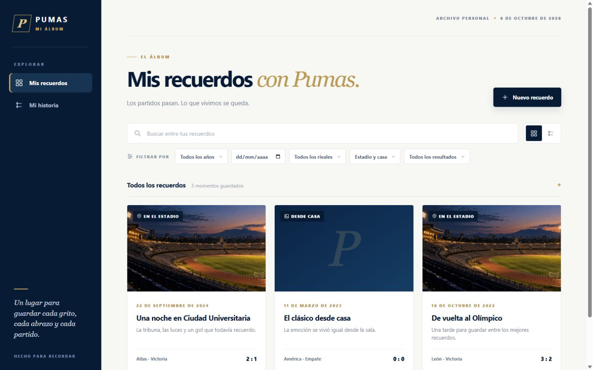
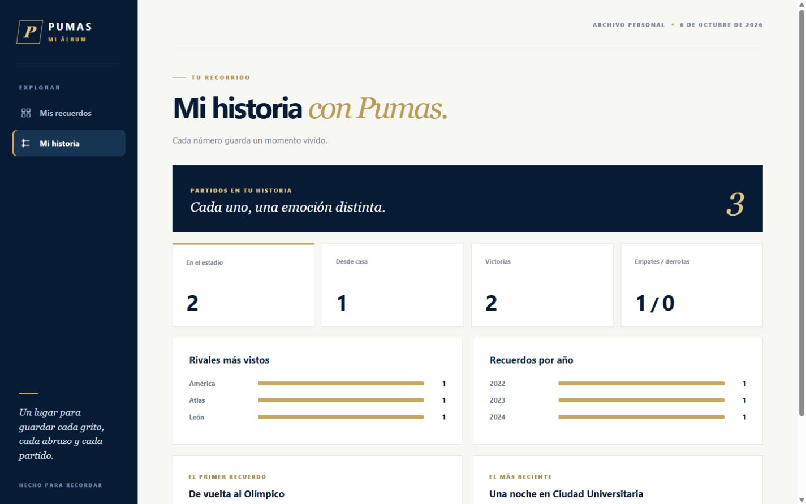
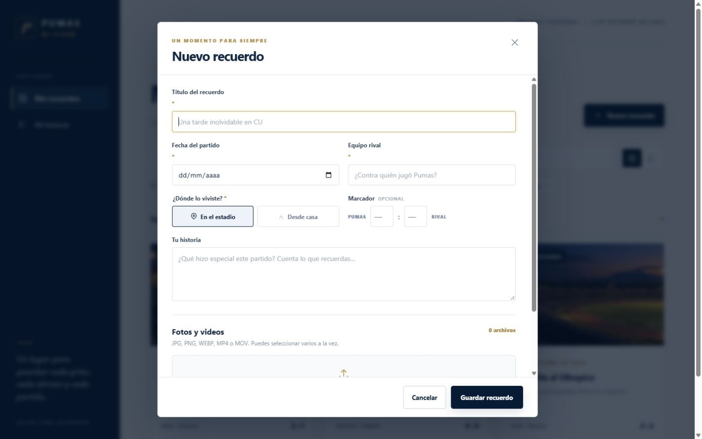
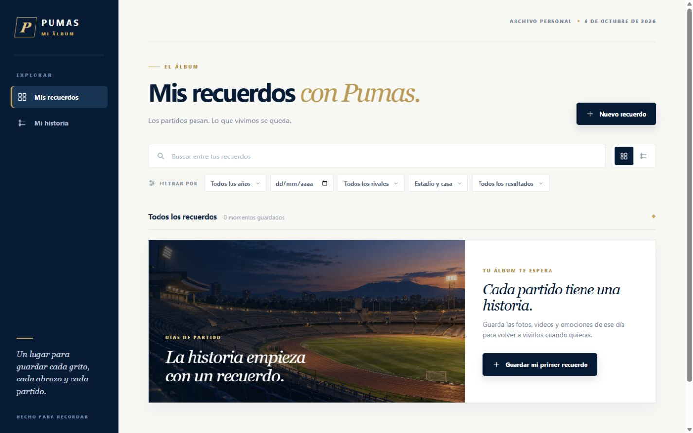

# Mis recuerdos con Pumas

Álbum web personal para conservar partidos de Pumas UNAM vistos en el Estadio Olímpico Universitario o desde casa. Permite reunir fotos, videos y notas de cada encuentro en una galería que crece con el tiempo. Es un proyecto independiente, no oficial.

## Objetivo

Ofrecer un espacio privado y duradero para volver a los momentos vividos como aficionado, sin depender de una cuenta ni de un servicio externo.

## Funcionalidades

- Crear, editar y eliminar recuerdos con fecha, rival, lugar, descripción y marcador opcional.
- Subir varias fotos y videos por recuerdo; ordenarlos, elegir portada y recorrerlos en un mismo visualizador.
- Alternar entre galería y línea del tiempo; buscar y filtrar por fecha, año, rival, lugar y resultado.
- Consultar estadísticas calculadas a partir de los recuerdos guardados.
- Conservar publicaciones en SQLite y archivos originales en disco después de cerrar la aplicación.

## Capturas

Las capturas muestran la aplicación real con **datos de demostración aislados**. No incluyen recuerdos personales.

| Galería | Mi historia |
| --- | --- |
|  |  |

| Nuevo recuerdo | Álbum vacío |
| --- | --- |
|  |  |

## Tecnologías y estructura

Node.js 24, servidor HTTP nativo, SQLite integrado en Node y HTML, CSS y JavaScript sin frameworks ni dependencias externas.

```text
mis-recuerdos-pumas/
├── server.js                 # API, validación, base de datos y archivos
├── public/                   # Interfaz y recursos visuales
├── tests/                    # Prueba de integración con datos temporales
├── docs/screenshots/         # Capturas con datos de demostración
├── Iniciar aplicación.cmd    # Inicio rápido en Windows
└── .env.example              # Opciones de configuración
```

La carpeta `data/` se crea al iniciar. Contiene la base de datos, las fotos y los videos personales, y está excluida de Git.

## Ejecutar localmente

1. Instala [Node.js 24 o posterior](https://nodejs.org/).
2. Clona el repositorio y entra en la carpeta:

   ```bash
   git clone https://github.com/MiguelJimenez12/pumas-match-memories.git
   cd pumas-match-memories
   npm start
   ```

3. Abre [http://127.0.0.1:3000](http://127.0.0.1:3000). Mantén la terminal abierta mientras usas la aplicación.

En Windows también puedes abrir `Iniciar aplicación.cmd` desde la carpeta clonada. No se necesita `npm install`. Ejecuta `npm test` para verificar los flujos principales con una base de datos temporal.

Los límites iniciales son 2 GB por archivo y 50 GB de almacenamiento total. Se pueden cambiar con `MAX_FILE_MB` y `MAX_STORAGE_GB`; `PORT`, `HOST` y `DATA_DIR` también son configurables (consulta `.env.example`). Respalda **toda** la carpeta `data/` para conservar o transferir tus recuerdos.

## Notas y futuras mejoras

Se admiten JPG, PNG, WEBP, MP4 y MOV. Algunos códecs MOV no se reproducen en todos los navegadores; en ese caso el archivo sigue disponible para descargar. La aplicación escucha solo en `127.0.0.1` por defecto. Para publicarla en Internet harían falta autenticación, HTTPS y copias de seguridad automatizadas.
